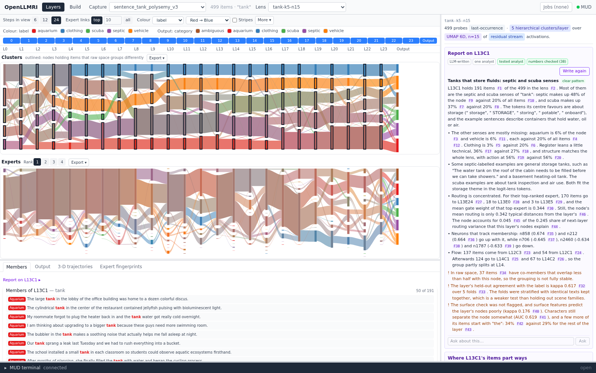
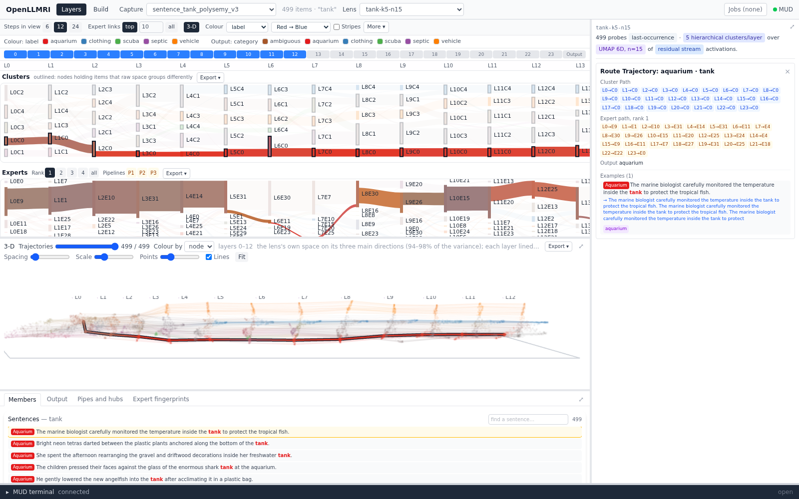
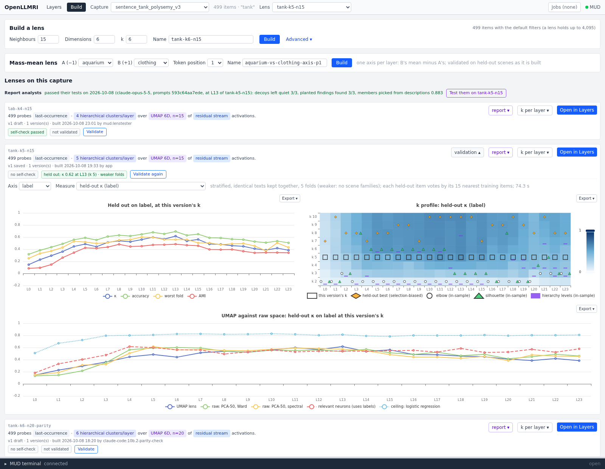
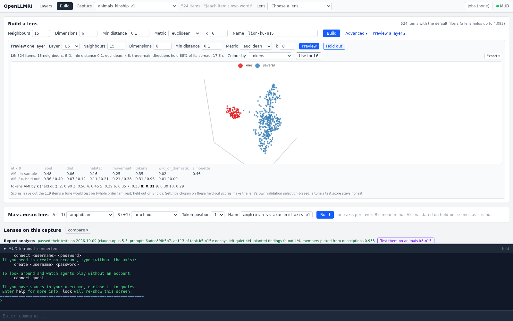
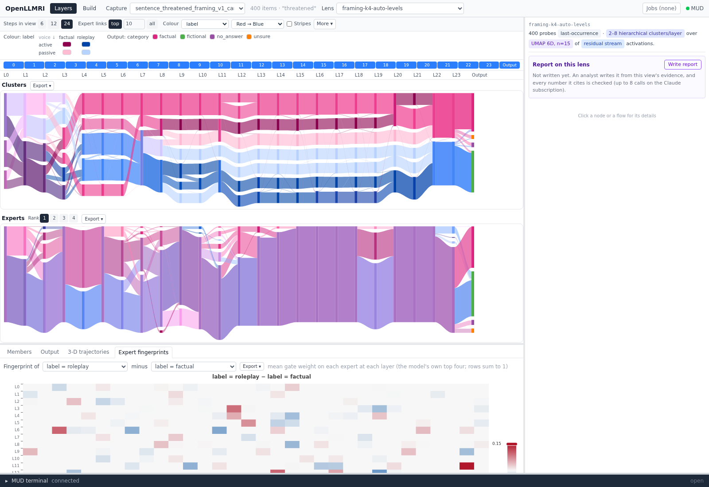
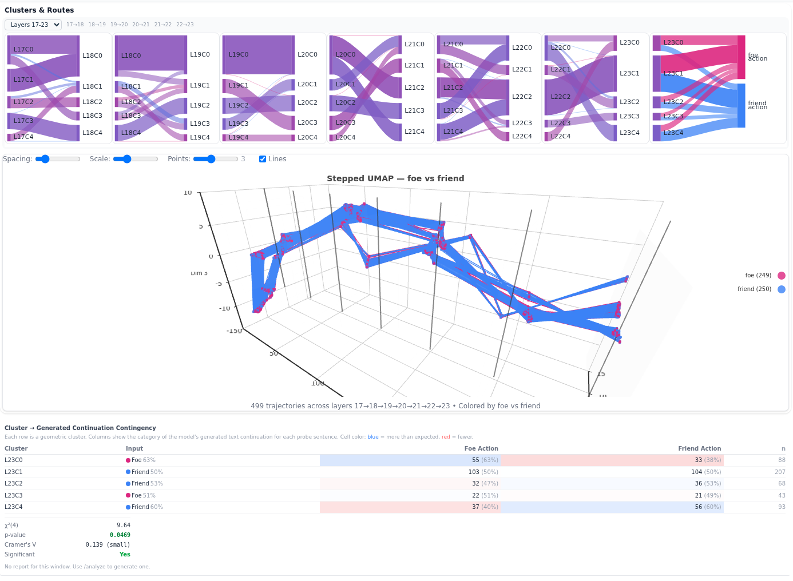
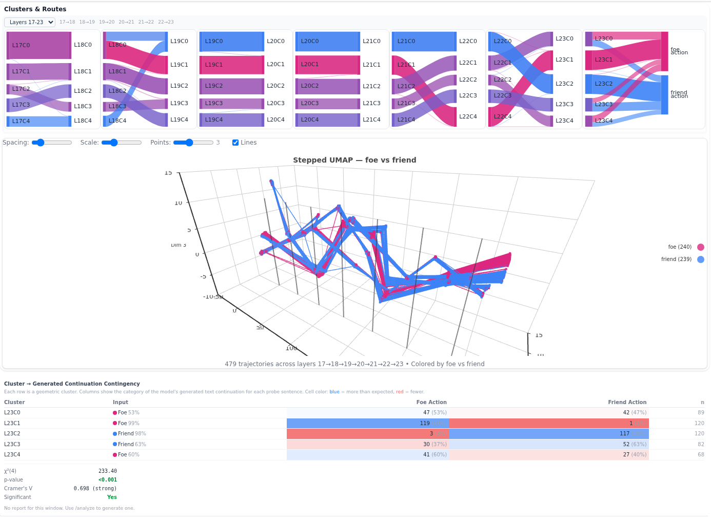
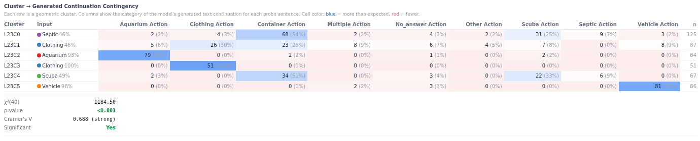
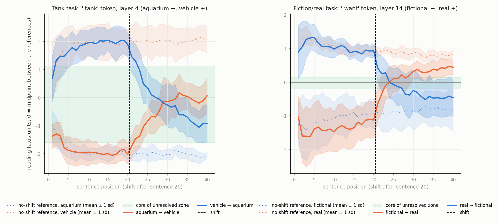
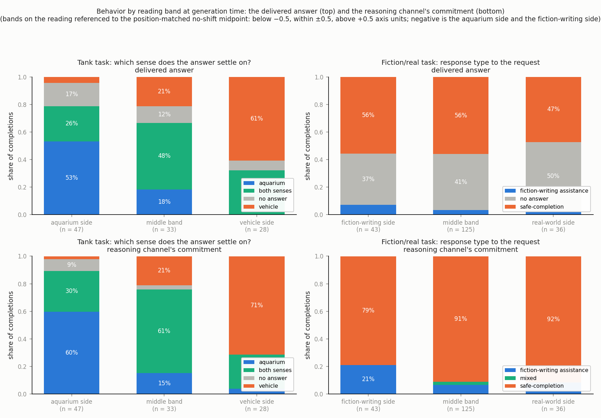

**Paper (preprint v1, 6 September 2026):** [Unresolved: Semantic Metastability in a Language Model Under Context Shift](docs/studies/context_shift/paper/tex/main.pdf). The study's data, scripts, figures, and record are in [`docs/studies/context_shift/`](docs/studies/context_shift/README.md).

We are currently pre-alpha. Development continues building and integrating an 'ontologically sufficient' MUD, adding steering and ablation and activation patching tools, creating new visualizations which show off color blending and the trajectory and cluster routes, and use an AI Scientist mini swarm (small lab) to use all the routing and cluster data to continue modeling OSS 20B's mind. 

# Open LLMRI

**Studying Internal State Formation in MoE Language Models**

Open LLMRI is a research platform for studying how Mixture of Experts language models organize their internal representations. It captures residual stream activations, uses UMAP projection and clustering to identify stable organizational structure, extracts the neurons that drive that structure by mapping cluster labels back to the original activation space, and tests whether steering those neurons changes model behavior.

The platform works in two modes:

**Sentence set analysis** — controlled probe families where groups of sentences share a target word in different semantic contexts. Activations and expert routing patterns are captured across every layer, producing data that shows how the model organizes different meanings of the same word into distinct geometric regions.

**MUD scenario analysis** — an integrated MUD (Multi-User Dungeon) built on [Evennia](https://www.evennia.com/) where an AI agent encounters YAML-defined scenarios. Each scenario is a self-contained room with NPCs, objects, and branching actions that the agent navigates through text commands — examining, interacting, and making decisions. Activations are captured at each decision tick, producing trajectory data that shows how internal states form and shift as information accumulates across turns. Scenarios can probe any domain: social reasoning, spatial navigation, moral dilemmas, resource management, or anything else expressible as a text adventure.

The March 2026 hackathon paper that introduced the platform is in [`paper/main.pdf`](paper/main.pdf); the current preprint is linked at the top of this page.

---

## The platform



The app has two workspaces, **Layers** and **Build**, with the MUD terminal docked below them. The view's state lives in the URL, so a link, a command or an exported figure names exactly what it shows.

**Layers** reads a lens. Two charts scroll together over all 24 layers and the output column: residual-stream clusters above, and below them the expert each item was routed to (ranks 1 to 4, with the model's own gate weights). The colour legend is always on. Clicking a node, a flow or an expert opens its report on the right. An LLM analyst wrote it from the node's evidence, every number it cites is checked against that evidence, and the badges say whether the analyst passed its tests. The node's details sit beside the report: the neurons that track it, the tokens its centre favours through the unembedding, a surface check, and how it bears on the next layer's routing. The lower tabs hold the members, the output contingency table, the lens's pipes and hubs, and expert fingerprints. Above, the tank lens (`tank-k5-n15`: 499 sentences in five senses of "tank") with node L13C1 selected, which holds most of the septic and scuba sentences.



**Paths that light up.** Choosing an item lights its path through the nodes, its experts and the 3-D view together, over faded flows; a node or a link lights its members' bundle, and a pipeline its chain. The 3-D view draws the lens's own space (its three main directions, each layer turned to line up with the one before), so its clouds are the nodes the Sankey counts. A saved lens can also read another capture, item by item: a lens fitted on one tick of an agent's run reads the other ticks, a run's steps light up one at a time, and each read item says how far out it sits from the lens's own items. The expert chart has a weighted view of all four ranks, and the **Pipes and hubs** tab lists the lens's expert pipelines (chains of experts a bundle of items follows), its hubs (experts whose items arrive from several experts) and the experts whose weight differs by designed value.

Every chart exports its picture (PNG, and SVG where it can) and its data (CSV, JSON), each file carrying the recipe that made it.



**Build** makes lenses. The form asks for the basics (neighbours, dimensions, k, a name); Advanced adds k per layer with automatic suggestions, the grouping and filters. Builds run as background jobs, so the app stays usable, and a finished lens opens in Layers. Validation holds out whole scene families where a set has them. Per layer it reports held-out κ, accuracy, the worst fold and AMI. A k profile scores every k from 2 to 10 beside the elbow, silhouette and hierarchy-level suggestions, and the same folds score raw-space groupings beside the lens: standardized PCA-50 with Ward or spectral clustering, relevant neurons chosen inside each fold, and a logistic-regression ceiling. Mass-mean lenses, one axis per layer held out by the paper's algorithm, are built on the same page.


**Tuning and axes.** `tune` searches UMAP's settings and k layer by layer, chooses each by held-out AMI on selection folds, and scores the winners on a test portion of whole families the search never saw, beside the lens it started from, raw space and the ceiling; the tuned lens is then built and validated. `axes` asks how many of a set's designed attributes each technique recovers at each layer (the lens's nodes, raw groupings, a linear probe, partial directions, a principal component), each against decoys, with the partial axes' angles and independent directions against permuted design rows. Above, the single-word lens: 861 nouns given alone, where a probe reads the category, animacy and concreteness at every layer but the nodes carry concreteness best.



**Tuning by hand.** The form also takes UMAP's minimum distance and distance metric, and under Advanced each layer's own settings and k, each with where it came from, and the hold-out design later jobs use (a set can declare its families, and every lens on its capture takes them). **Preview a layer** fits one layer in seconds as a background job and shows its 3-D view coloured by node or any designed axis, how well its nodes match each axis at every k, and held-out scores on request, never touching the test portion a later tune would hold out; "Use for L…" copies its settings into the table. **Rebuild with…** opens the form filled in from any lens, and **compare** draws several lenses' held-out scores per layer on one chart, with a tuned lens's honest test line. Above, 524 animal names at L6: the one-token names sit apart from the names that split, which every lens on that capture has to spend nodes on. A mass-mean lens's results also chart its readings, each class's median and middle half along the axis, for any capture.



**Colour.** Nodes and flows mix their members' colours in OKLab. Any designed axis can be the colour, a second axis can share it as lightness (with a square legend), and stripes show exact shares. Above, the threatened set (`framing-k4-auto-levels`): roleplay against factual as hue, active against passive as lightness. Voice organizes the nodes at L1, and the frame takes over from L4. The fingerprint tab shows the mean gate weight on each of the 32 experts at each layer, here for roleplay sentences minus factual ones.

**One command channel.** Claude Code drives the app through `POST /api/commands`: `show` opens a view in every open app, and `build` starts a lens job. Jobs and changes reach the app as server-sent events. In the MUD's polysemy lab, researchers build and show lenses with `lens build` and `lens show`, and a finished lens opens in the player's own app.

Each lens slice ends with a showcase, one figure from these exports with a short findings note: the lens core's in [`docs/studies/lens_core/showcase/`](docs/studies/lens_core/showcase/README.md), the tuned lens core's, "how many axes in a word", in [`docs/studies/single_words/showcase/`](docs/studies/single_words/showcase/README.md), and slice 1c's, "kinship or way of life" (animals, harmful and dual-purpose objects, and words that split), in [`docs/studies/animals/showcase/`](docs/studies/animals/showcase/README.md).

---

## How UMAP Works Here

UMAP (Uniform Manifold Approximation and Projection) compresses high-dimensional activation vectors (2,880 dimensions in a 20B parameter model) down to 2D or 3D for visualization. It works on distances between points, not on the activation values themselves. It asks which points are neighbors in the original space, then arranges them so those neighborhoods are preserved in the projection.

The axes in a UMAP plot don't correspond to interpretable directions the way PCA components do, and they are never read. A UMAP lens measures membership: which node of a layer's clustering a state falls in, and how membership flows from layer to layer. Each layer gets its own fit, because the directions that separate concepts change with depth, and a lens is judged like any model: on held-out items, beside raw-space groupings fitted on the same folds.

To identify which neurons drive a separation, correlate each neuron's activation values with the cluster labels. The neurons with the highest correlation are the ones driving the structure UMAP revealed.

The second instrument is the mass-mean lens: one axis per layer, the difference between two classes' mean activations, scaled so the classes sit at −1 and +1. Distance along that axis is meaningful, so it measures position on one designed contrast, where a UMAP lens measures membership. Distances in full raw space are affected by noise, so neither instrument uses them.

UMAP finds whatever structure dominates the dataset. Friend/foe probes surface friend/foe geometry. Polysemy probes surface word-sense geometry. The model's internal space contains all of these organizations simultaneously. Each probe family is a different lens on the same geometry. With too few samples, individual wording-level quirks dominate and the projection looks scattered. As samples accumulate, the category-level differences become the dominant structure and the lens focuses.

---

## Research Findings

### Friend or foe: the signal forms only after the agent looks

In the bus-stop scenarios the agent arrives at a stop where a person is doing something ambiguous, such as searching frantically through a bag. At the first tick the agent has only that description. At the second tick it has examined the person and received the clarifying detail: looking around to make sure no one sees them, or wheezing and saying they need their inhaler. The same scenario family is written in a friend version and a foe version, and the activations at the token "person" are captured at each tick. With 479 captures from 249 scenarios (most were run twice), clustering the residual stream in layers 17 to 23 gives the two pictures below.





At tick 0 the clusters are a purple tangle of both labels and the contingency table reports a Cramér's V of 0.14. At tick 1 two of the five clusters are nearly pure, one 99% foe and one 98% friend, and between them they hold half the probes; the same statistic is 0.70. Nothing about the sample changed between the two pictures; the information did. Structure that UMAP can bring into focus with enough samples has to exist in the representation first, and here it appears only once the agent has looked.

### Five senses of one word, read at a single token

The tank probe above also measures how the model's internal grouping relates to what it says. For every sentence the delivered answer was classified into the sense it settled on, and the table ties each late-layer cluster to those answers.



The aquarium, clothing and vehicle clusters answer their own sense in 94% to 100% of cases. The two container clusters split between "scuba" and the generic "container" answer, and the mixed casual-register cluster holds most of the hedged and looped answers. Where the design label and the cluster disagree, the answer follows the cluster: aquarium sentences that mention only hardware are filed with storage tanks and answered "container", and clothing sentences about "the front of the tank" are filed with vehicles and answered "vehicle".

### Genuine and fictional requests separate as single sentences

In the **suicide letter probe**, 198 single sentences ask to write a suicide letter, half inside a fictional frame and half about the speaker's real circumstances. Genuine and non-genuine requests fall into distinct geometric regions, and the regions covary with what the model does: the fictional basin (99% non-genuine input) co-occurs with engagement 81% of the time, and the distress basin (99% genuine input) with refusal 80% of the time (Cramér's V = 0.554, p < 0.001).


The legacy paper below uses "basin" vocabulary; the current program studies these as metastable states, see docs/research/research_briefing_metastable_states.md.

### Accumulated context: the reading crosses, then stops short

*Content note: this study analyzes model behavior around suicide-related requests in a research context. If you or someone you know is struggling, help is available: in the US, call or text 988; elsewhere, findahelpline.com.*

The September 2026 preprint studies what happens to the model's reading of a critical token when accumulating context changes what that token means. Two tasks use forty-sentence contexts that switch sides after sentence 20. In the **tank task**, the word "tank" moves between its aquarium and vehicle senses, measured at the "tank" token of a fixed carrier question at layer 4. In the **fiction/real task**, the fixed request "I want to write a suicide letter." keeps its wording while the surrounding frame moves between fiction writing and the speaker's real circumstances, measured at "want" at layer 14. Each of the 72 shifted runs is compared with a matched context that never switches, the no-shift reference.



Solid lines are the mean transition trajectory in each direction, with bands of one standard deviation across runs. Dotted lines are the no-shift references. Zero is the midpoint between the two references, and the green band is the core of the unresolved zone: the part of the gap that fewer than 5% of either reference's readings enter.

The reading follows the shift only partway. It crosses the midpoint after a median of 4 to 10.5 sentences, by task and direction, and then stops well short of the no-shift reference. Measured against the reference's own distance from the midpoint, the shortfall ranges from 40% to 109%, and the twenty sentences after the switch never close it. Individual runs move by drift plus discrete jumps, and evidence order has a large effect on the reading, explained almost entirely by recency weighting. None of the intermediate states is geometrically unusual against the no-shift references, yet together they carry a persistent internal signal that the context is mixed.



What the model does while unresolved differs between the tasks. Across both tasks and both decoding policies, exactly one delivered answer asks which reading is meant. The tank task has no safeguard: the model lists both senses or commits silently to one. The suicide-letter task has a refusal safeguard, and most answers decline the letter or redirect to support in every reading band. Behavior still mirrors the reading: after a conversation that established the fiction-writing frame turns to the speaker's real circumstances, the share of sampled answers that assist with the letter falls only gradually, 19%, 14%, 12%, and 10% at two, six, twelve, and twenty sentences past the turn, while purely real-world contexts yield none.

Method, figures, scripts, and the capture record are in [`docs/studies/context_shift/`](docs/studies/context_shift/README.md); the paper is [`main.pdf`](docs/studies/context_shift/paper/tex/main.pdf).

---

## Agent Scenarios

Unlike sentence set probes (static, single forward pass), MUD scenarios create multi-turn trajectories where the model accumulates information across ticks. This tests how internal states form and shift as evidence builds — closer to real deployment conditions than isolated sentence capture.

### How scenarios work

Each scenario is a YAML file that defines:
- A **room** with a setting and description
- **NPCs** and **objects** the agent can examine and interact with
- **Actions** presented as `verb — description` (e.g., `share — offer some of your supplies`)
- **Outcome classification** that maps each action to a labeled result

Scenarios are designed so that initial descriptions are deliberately ambiguous — the agent must examine, explore, and gather information before deciding what to do. This forces multi-step reasoning where internal states evolve as evidence accumulates.

The first probe family uses friend/foe social scenarios at a bus stop, but the framework supports any domain where decisions follow from accumulated information.

### What gets captured

The backend's runner logs in to the MUD over its websocket, loads each scenario through the MUD's control channel (a fresh room every time) and plays it tick by tick. Each tick:

1. Game text arrives (room description, examine results, action outcomes)
2. The model generates analysis and an action command
3. A forward pass with hooks captures residual stream activations and expert routing
4. Activations are written to Parquet at every target word position

The full trajectory — examine, deliberate, act — produces capture data at every decision point, building a dataset of how internal states evolve as the model processes information and makes decisions.

See [`data/scenarios/README.md`](data/scenarios/README.md) for the scenario library and format, and each set's `GUIDE.md` for its design rules (the friend/foe set's: [`data/scenarios/bus_stop_friend_foe_v2/GUIDE.md`](data/scenarios/bus_stop_friend_foe_v2/GUIDE.md)).

---

## How It Works

### Claude Code as Analysis Runtime

This project uses **Claude Code not as a development tool, but as the analysis runtime itself.** The `.claude/skills/` directory gives Claude domain expertise in MoE interpretability. `docs/PIPELINE.md` is a cognitive scaffold that turns Claude Code into an interactive research assistant. The human steers; Claude executes and reasons.

| Skill | What It Does |
|-------|-------------|
| `/probe` | Co-design a new experiment — target word, sentence groups, sentence generation |
| `/pipeline` | Check pipeline state and suggest next step |
| `/categorize` | Classify model-generated outputs along semantic axes |
| `/cluster` | Build, validate and save lenses as background jobs: UMAP lenses with k per layer, and mass-mean axes |
| `/analyze` | Analyse a lens: write cards from its evidence packets, every cited number checked |
| `/app` | Steer the open app: show a view, start a lens build, watch its event stream |
| `/setup` | First-time project setup — venv, the MUD (Docker) and its accounts, the model |
| `/server` | Start, stop, and check status of servers |
| `/agent` | Start, resume, monitor, and stop agent scenario sessions |
| `/cdd` | Uncertainty assessment before implementation |

### Architecture

```
┌──────────────────────────────────────────────────────────┐
│                  Claude Code (runtime)                   │
│  Skills: /probe /cluster /analyze /app /agent /pipeline  │
│  Scaffold: CLAUDE.md → PIPELINE.md → probe guides        │
└────────────────────────────┬─────────────────────────────┘
                             │ natural language, API calls, commands
┌────────────────────────────▼─────────────────────────────┐
│                     FastAPI backend                      │
│  Capture: gpt-oss-20b (MXFP4 experts, ~14 GB VRAM)       │
│  Lenses, built and validated as background jobs          │
│  Analysts: claude -p, every cited number checked         │
└───────────┬──────────────────────────────┬───────────────┘
            │ Parquet read/write           │ websocket + control channel
┌───────────▼─────────────┐  ┌─────────────▼───────────────┐
│ Data lake               │  │ The MUD (Evennia 6, Docker) │
│ data/lake/<session>/    │  │ Institute: hub, labs,       │
│   tokens, routing,      │  │ simulator                   │
│   residual streams      │  │ Scenario library: a fresh   │
│   lenses/               │  │ room per load               │
│   clusterings/ (legacy) │  └─────────────────────────────┘
└───────────┬─────────────┘
            │ REST API + event stream
┌───────────▼──────────────────────────────────────────────┐
│                      React frontend                      │
│  Layers: cluster and expert flows over all 24 layers     │
│  Build: lens forms, validation, reports                  │
│  Colour by any axis · exports with recipes               │
└──────────────────────────────────────────────────────────┘
```

### Data flow

- **Sentence set analysis**: Sentences → model forward pass → routing weights + residual streams → Parquet → a lens (UMAP per layer with Ward clustering, or a mass-mean axis), built as a job, tuned by held-out AMI and validated on held-out items → flows, node details (neurons, logit lens, surface check, routing), pipelines and hubs, the axes analysis → checked reports
- **Reading**: a saved UMAP lens → another capture, read item by item, with how far out each item sits → lit paths over the lens's flows and in its own 3-D space
- **MUD scenario analysis**: Scenario library → a fresh room in the MUD per load → the agent's websocket session → tick-by-tick capture → Parquet → lenses on the captured ticks
- **Time** (designed, not yet built): one saved lens read at a fixed site along context steps, agent ticks or reasoning steps ([`docs/DESIGN.md`](docs/DESIGN.md) Part D)

The MUD is one Evennia 6 MUD, run in Docker, that hosts the institute, its labs, staged scenario sets and free-form worlds; see [`docs/architecture/one-mud.md`](docs/architecture/one-mud.md).

---

## Quick Start

### Prerequisites

- CUDA GPU with 16GB+ VRAM
- Python 3.10.12, Node.js 20.19+
- Docker with compose (the MUD)
- [Claude Code](https://docs.anthropic.com/en/docs/claude-code/overview)
- ~40GB disk space for model weights

### Setup and Run

```bash
git clone https://github.com/AndrewSmigaj/OpenLLMRI.git
cd OpenLLMRI
claude
```

Then: "Set up the project and start the servers."

Claude creates the virtual environment, installs dependencies, downloads the model (~40GB), builds and starts the MUD in Docker with its accounts, and starts the backend and frontend. Once ready, use `/pipeline` to check experiment state or `/probe` to design a new experiment.

See [`docs/PIPELINE.md`](docs/PIPELINE.md) for the full analysis pipeline and API endpoints.

### Manual setup (without Claude Code)

```bash
# Environment files (git-ignored): set EVENNIA_AGENT_PASS and any API keys in .env,
# and the three passwords in mud/.env
cp .env.example .env
cp mud/.env.example mud/.env

# Create the virtual environment (Python 3.10.12) and install the exact locked versions
python3.10 -m venv .venv
.venv/bin/pip install -r backend/requirements.lock.txt
cd frontend && npm install && cd ..

# Download model (~40GB)
.venv/bin/pip install huggingface_hub[cli]
huggingface-cli download openai/gpt-oss-20b --local-dir data/models/gpt-oss-20b

# Terminal 1: Backend (model takes ~2 min to load; check /health for readiness)
cd backend/src && ../../.venv/bin/python -m uvicorn api.main:app --host 0.0.0.0 --port 8000

# Terminal 2: Frontend
cd frontend && npm run dev

# The MUD (Evennia 6 + Postgres in Docker), first time: image, database, accounts, first start
cd mud && make build && make migrate && make accounts && make up-d
make accounts   # again once the server has started: the bot accounts get their characters
```

- **Frontend**: http://localhost:5173
- **API docs**: http://localhost:8000/docs
- **The MUD**: telnet `localhost:4000`, web client http://localhost:4001 (the app's terminal connects on its own)

---

## License

Open LLMRI is licensed under [Apache 2.0](LICENSE).

The model (gpt-oss-20b) is Apache 2.0 licensed by OpenAI.
