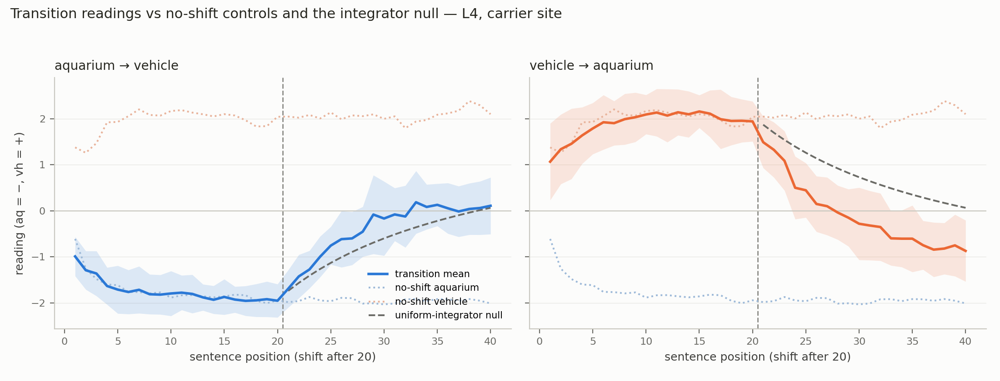
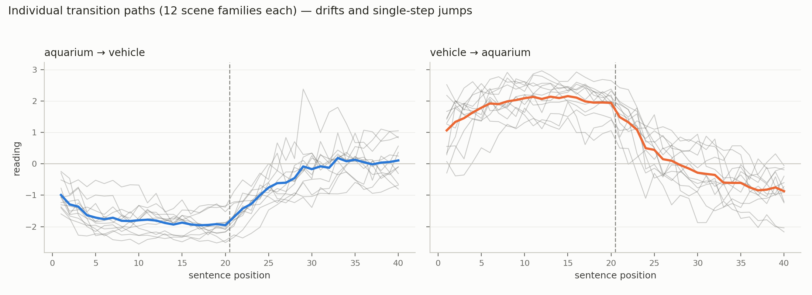
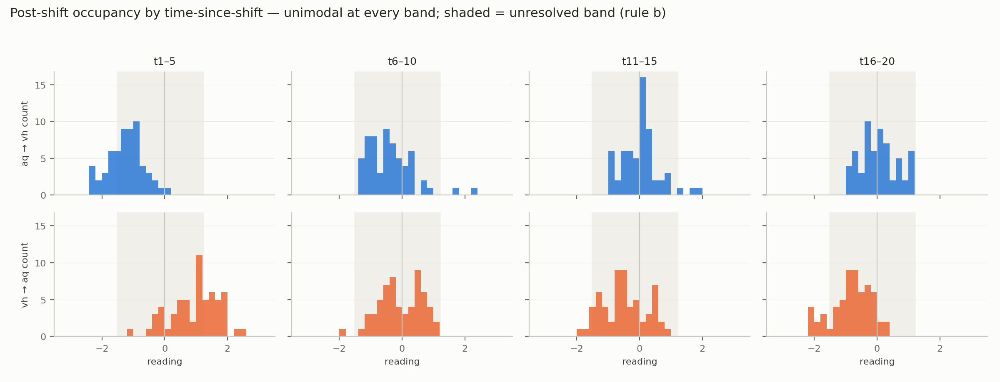
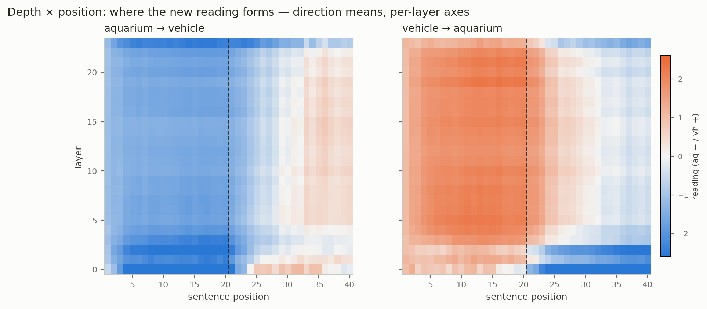
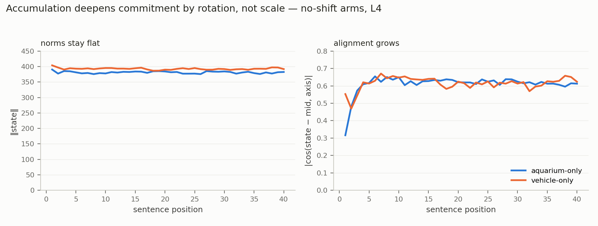
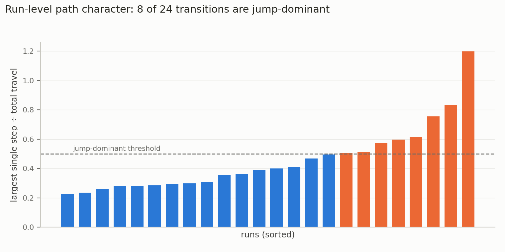
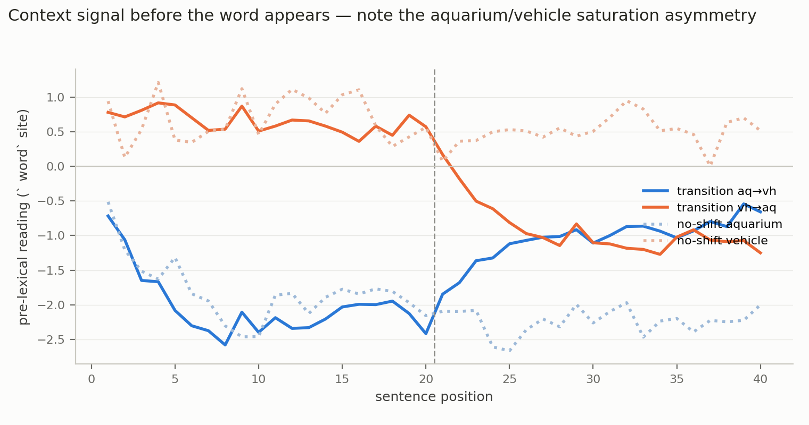
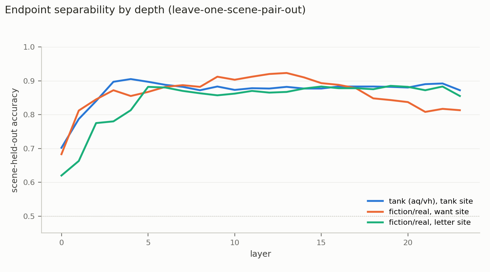

# Preliminary Findings — Metastable-States Study (as of 2026-08-28)

All claims below survived the full sanity pass (`sanity_pass_2026-08-28.md`). Vocabulary and
doctrine per `docs/research/research_briefing_metastable_states.md`. Expert routing is out of
this study (deferred; provenance in `router_track_tank.md`). Everything here is exploratory;
instruments sign their own claims; every number reproduces from a committed script.

## 1. Frame

Object of study: how contextual understandings form, shift, and fail to consolidate in the
residual stream — read on per-lens raw-activation axes (measurement) with UMAP clustering as
discovery only. Central question: when a reading sits between two understandings, is that a
learned state, a passage, or an off-manifold artifact? Standing baseline: every dynamics claim
is stated relative to a recency-weighted evidence-integrator null.

## 2. Corpus (all current-pipeline, harmony format, provenance-stamped)

| Artifact | Size | Status |
|---|---|---|
| Tank scene pools (D1b source) | 600 sentences, 24 scenes, audit PASS | captured as 600 calibration cells (`session_29a80932`) |
| Fiction/real pools (D2) | 900 sentences, 3 arms, audit PASS (quote-opener WARN handled) | S1/S2/S3 calibration cells captured (600/300/300) |
| Tank D3 transitions | 24 runs × 40 steps (12 scene families × 2 directions), Q1 carrier | captured + analyzed |
| Tank D4 no-shift controls | 12 runs × 40 steps | captured + analyzed |
| Checkpoint windows | 144/144 (4 per run, windowed full-position) | captured |
| Suicide D3/D4 (S1 grid + sub-arms + S2/S3 + controls) | 76 runs | capturing (58/76, all assertions ok); ANALYSIS PENDING |
| D1a five-sense lens set | 250/1000 generated | generation in progress |

## 3. Findings (tank arm + calibrations; tiered)

### Tier A — verified, multiple checks, load-bearing
1. **Endpoint separability in raw space, scene-held-out.** Tank aquarium/vehicle: 0.905 @L4
   (setting-inflation bounded at ~3 points vs random split). Fiction/real S1: 0.910 (want site)
   / 0.877 (letter site) @L14 — corrected values after a scene-naming CV-leakage fix.
   (`axis_projection.py`, `scene_heldout_calibration.py`)
2. **Stability under consistent evidence.** No-shift 40-sentence contexts hold a deep, tight
   reading throughout (±2 plateau, σ small). Long context alone is not destabilizing.
3. **Accumulation deepens commitment via alignment, not scale.** Readings pass the ±1
   single-sentence convention to ≈±2; residual norms flat (~380–400) while cos(state−mid, axis)
   grows 0.30→0.62. (`reassessment_checks.py`)
4. **Hysteresis (operational sense) is demonstrated.** Same carrier sentence, different context
   history → different reading; at +20 counter-sentences the transition reading remains far
   from the matched-position no-shift level (+0.11 / −0.87 vs ±2).
5. **Mechanism is consistent with recency-weighted evidence integration — no drag.** Observed
   trajectories run AHEAD of the uniform-integrator null at every checked point, both
   directions, robust to per-direction amplitudes. "Stickiness" beyond integration is an open
   question assigned to D6 (order effects at matched composition, vs a fitted-γ model).
6. **Transition-path heterogeneity.** Population occupancy at matched times is unimodal at
   every band (pooled and family-level dips; no shared third mode, no endpoint pile-up) — but
   run-level paths MIX smooth drift with large single-step jumps (8/24 runs move >50% of their
   travel in one step, 4–6× pre-shift step noise, jump times dispersed t=23–32). The strong
   learned-metastable-middle world is disfavored at the carrier site; graded-drift vs
   dispersed-passage is not yet separable (effective n=12 families).

### Tier B — verified, single-instrument or caveated
7. **Pre-lexical site carries context/topic signal** (not demonstrated as sense-specific):
   separable before the target word ever occurs in an episode; dose-dependent (weak from one
   sentence, strong from twenty). NEW caveat (sanity pass): strongly asymmetric — sustained
   aquarium context saturates the pre-lexical reading (−2.1) while vehicle reaches only +0.6.
8. **Two instrument traps, reproducible** (methods results): cross-position projection
   collapses to a constant; cross-token projection is token-identity-dominated (window tokens
   read −1.70±0.13 regardless of content). Same-site calibration is mandatory; band rule (b)
   requires position-matched no-shift endpoint distributions (single-sentence version is empty).
9. **Prior-design replication (labeled legacy):** the lens and the raw axis agree qualitatively
   on the old word-context corpus (fiction-collapse; incomplete consolidation), and the raw
   axis reveals beyond-endpoint readings the lens masked. (`dual_trajectory_figure.py`)

### Tier C — logged observations (hypotheses, not conclusions)
Direction asymmetry (vh→aq releases further/faster; exploratory until D6); L23 lags L4;
depth-profile difference between probes (tank peaks L4, fiction/real L14); dataset-geometry
log entries.

## 4. Retractions & corrections log (full transparency)
- "History suppresses new readings 2–20×" → withdrawn; integrator-consistency instead.
- "Traveling unimodal packet / graded world" → softened to the Tier-A-6 statement.
- S-carrier scene-held-out numbers corrected for CV leakage (0.925→0.910; 0.904→0.877).
- Router top-1/entropy conclusions retracted, then routing dropped from study entirely.
- One checker-side 2× bug caught and disclosed during the sanity pass (finding unaffected).

## 5. Open questions → pending work
Suicide-arm battery (trajectories, integrator null, occupancy; sub-arm and carrier
comparisons) · geometry battery (manifold distance, reconstruction, recurrence; endpoints+D4
reference) · tank unresolved-band behavior cells (wrong/hedged definitions vs reading) ·
suicide safeguard-vs-reading (continuous-primary, tiered reporting) · D6 with interleaved arm
(THE stickiness decider) · D7 history arms · extended-tail + carrier-replicate arms ·
final-step full backfill · D1a lens set.

## 7. Figures (regenerate: `python analysis/make_figures.py` → `analysis/figures/`)

| Figure | Shows |
|---|---|
|  `traj_null_L4` | Flagship: transitions vs no-shift controls vs the integrator null (Tier A-4/5) |
|  `spaghetti_L4` | Run-level heterogeneity — drifts and jumps (Tier A-6) |
|  `occupancy_bands_L4` | Time-banded occupancy, unresolved band shaded (Tier A-6) |
|  `heatmap_layer_position` | Depth × position: where the new reading forms; deep layers lag, surface layers snap (Tier C → promoted visual) |
|  `norm_vs_alignment` | Deepening is rotation, not scale (Tier A-3) |
|  `jumpiness` | 8/24 jump-dominant runs (Tier A-6) |
|  `prelexical_L4` | Pre-lexical signal + saturation asymmetry (Tier B-7) |
|  `calibration_layers` | Endpoint separability by depth, three axes (Tier A-1) |

## 6. Read these first (Andrew)
1. `findings/tank_d3_first_results.md` + its revision blocks — the dynamics story arc.
2. `analysis/reassessment_checks.py` output — the integrator null (the paper's fulcrum).
3. `findings/three_worlds_tank.md` + revision — occupancy verdict and its limits.
4. `findings/sanity_pass_2026-08-28.md` — what was checked and what changed.
